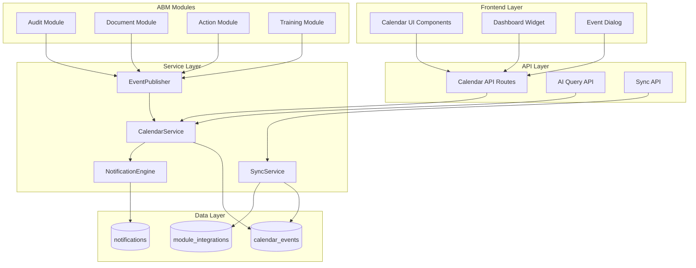
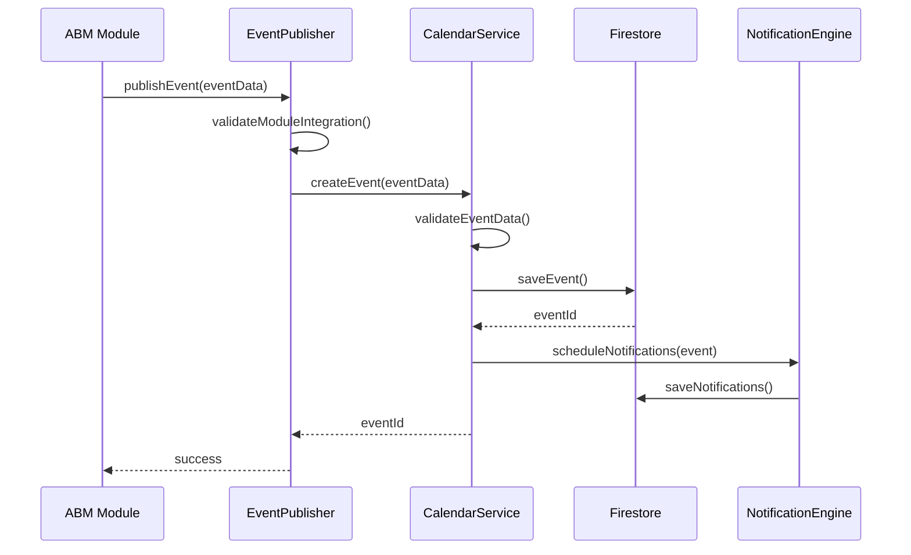

# Design Document - Sistema de Calendario Unificado

## Overview

El Sistema de Calendario Unificado es una infraestructura centralizada que consolida todas las fechas importantes del sistema ISO 9001 App. Proporciona una arquitectura basada en eventos que permite a todos los módulos ABM (Auditorías, Documentos, Acciones, Capacitaciones, etc.) publicar y consumir eventos de calendario de forma estandarizada.

### Objetivos de Diseño

1. **Arquitectura Desacoplada**: Los módulos ABM no dependen directamente del calendario, sino que publican eventos a través de una interfaz estándar
2. **Integración Progresiva**: Implementación por fases, comenzando con Auditorías y expandiendo módulo por módulo
3. **Consistencia de Datos**: Sincronización automática entre eventos de calendario y registros de origen
4. **Escalabilidad**: Diseño optimizado para manejar miles de eventos sin degradación de rendimiento
5. **Acceso para IA**: APIs especializadas para que sistemas de IA puedan consultar y analizar eventos por usuario

### Tecnologías Utilizadas

- **Frontend**: Next.js 14 (App Router), React 18, TypeScript
- **Backend**: Next.js API Routes, Firebase Functions (futuro)
- **Base de Datos**: Cloud Firestore
- **Autenticación**: Firebase Auth
- **UI Components**: Radix UI, Tailwind CSS
- **Validación**: Zod
- **Manejo de Fechas**: date-fns

## Architecture

### High-Level Architecture



### Architectural Patterns

1. **Publisher-Subscriber Pattern**: Los módulos ABM publican eventos sin conocer los consumidores
2. **Service Layer Pattern**: Lógica de negocio centralizada en servicios reutilizables
3. **Repository Pattern**: Abstracción de acceso a datos a través de servicios
4. **Event Sourcing (Ligero)**: Eventos mantienen referencia a su origen para trazabilidad
5. **API Gateway Pattern**: APIs centralizadas para acceso unificado

### Integration Flow



## Components and Interfaces

### Core Data Models

#### CalendarEvent

```typescript
interface CalendarEvent {
  id: string;

  // Información básica
  title: string;
  description: string | null;
  date: Timestamp;
  endDate: Timestamp | null; // Para eventos multi-día

  // Categorización
  type: EventType;
  sourceModule: SourceModule;
  status: EventStatus;
  priority: EventPriority;

  // Origen y trazabilidad
  sourceRecordId: string; // ID del registro origen (audit, document, etc.)
  sourceRecordType: string; // Tipo del registro origen
  sourceRecordNumber: string | null; // Número de auditoría, documento, etc.

  // Responsabilidad
  responsibleUserId: string | null;
  responsibleUserName: string | null;
  participantIds: string[] | null; // Para eventos con múltiples participantes

  // Organización
  organizationId: string;
  processId: string | null;
  processName: string | null;

  // Metadata adicional
  metadata: Record<string, any> | null; // Datos específicos del módulo

  // Notificaciones
  notificationSchedule: NotificationSchedule | null;
  notificationsSent: boolean;

  // Recurrencia (para eventos personales)
  isRecurring: boolean;
  recurrenceRule: RecurrenceRule | null;

  // Auditoría
  createdAt: Timestamp;
  updatedAt: Timestamp;
  createdBy: string;
  createdByName: string;
  isActive: boolean;
  isSystemGenerated: boolean; // true para eventos de ABM, false para personales
}

type EventType =
  | 'audit'
  | 'document_expiry'
  | 'action_deadline'
  | 'training'
  | 'evaluation'
  | 'meeting'
  | 'general';

type SourceModule =
  | 'audits'
  | 'documents'
  | 'actions'
  | 'trainings'
  | 'evaluations'
  | 'custom';

type EventStatus =
  | 'scheduled'
  | 'in_progress'
  | 'completed'
  | 'cancelled'
  | 'overdue';

type EventPriority = 'low' | 'medium' | 'high' | 'critical';
```

#### ModuleIntegration

```typescript
interface ModuleIntegration {
  id: string;
  moduleName: SourceModule;
  displayName: string;
  isEnabled: boolean;
  integrationStatus: 'pending' | 'active' | 'disabled' | 'error';

  // Configuración
  config: {
    autoCreateEvents: boolean;
    autoUpdateEvents: boolean;
    autoDeleteEvents: boolean;
    defaultNotifications: boolean;
  };

  // Estadísticas
  stats: {
    totalEvents: number;
    activeEvents: number;
    lastSyncAt: Timestamp | null;
    lastError: string | null;
  };

  // Auditoría
  createdAt: Timestamp;
  updatedAt: Timestamp;
  enabledBy: string | null;
  enabledByName: string | null;
}
```

#### NotificationSchedule

```typescript
interface NotificationSchedule {
  sevenDaysBefore: boolean;
  oneDayBefore: boolean;
  onEventDay: boolean;
  customDays: number[] | null; // Días personalizados antes del evento
}

interface RecurrenceRule {
  frequency: 'daily' | 'weekly' | 'monthly' | 'yearly';
  interval: number; // Cada cuántos períodos (ej: cada 2 semanas)
  endDate: Timestamp | null;
  occurrences: number | null; // Número de repeticiones
}
```

### Service Interfaces

#### CalendarService

```typescript
class CalendarService {
  // CRUD Operations
  static async createEvent(data: CalendarEventCreateData): Promise<string>;
  static async getEventById(id: string): Promise<CalendarEvent | null>;
  static async updateEvent(
    id: string,
    data: Partial<CalendarEventUpdateData>
  ): Promise<void>;
  static async deleteEvent(id: string): Promise<void>;

  // Query Operations
  static async getEventsByDateRange(
    startDate: Date,
    endDate: Date,
    filters?: EventFilters
  ): Promise<CalendarEvent[]>;

  static async getEventsByUser(
    userId: string,
    filters?: EventFilters
  ): Promise<CalendarEvent[]>;

  static async getEventsByModule(
    module: SourceModule,
    filters?: EventFilters
  ): Promise<CalendarEvent[]>;

  static async getUpcomingEvents(
    days: number,
    filters?: EventFilters
  ): Promise<CalendarEvent[]>;

  static async getOverdueEvents(
    filters?: EventFilters
  ): Promise<CalendarEvent[]>;

  // AI Query Operations
  static async getUserWorkload(
    userId: string,
    period: 'week' | 'month' | 'quarter'
  ): Promise<UserWorkload>;

  static async getUserAvailability(
    userId: string,
    dateRange: { start: Date; end: Date }
  ): Promise<AvailabilitySlot[]>;

  static async getEventContext(eventId: string): Promise<EventContext>;

  // Statistics
  static async getStats(filters?: EventFilters): Promise<CalendarStats>;
}
```

#### EventPublisher

```typescript
class EventPublisher {
  // Publicar eventos desde módulos ABM
  static async publishEvent(
    module: SourceModule,
    eventData: PublishEventData
  ): Promise<string>;

  static async updatePublishedEvent(
    module: SourceModule,
    sourceRecordId: string,
    updates: Partial<PublishEventData>
  ): Promise<void>;

  static async deletePublishedEvent(
    module: SourceModule,
    sourceRecordId: string
  ): Promise<void>;

  // Validación de integración
  static async validateModuleIntegration(
    module: SourceModule
  ): Promise<boolean>;

  // Sincronización masiva
  static async syncModuleEvents(module: SourceModule): Promise<SyncResult>;
}
```

#### NotificationEngine

```typescript
class NotificationEngine {
  // Programar notificaciones para un evento
  static async scheduleNotifications(event: CalendarEvent): Promise<void>;

  // Cancelar notificaciones de un evento
  static async cancelNotifications(eventId: string): Promise<void>;

  // Procesar notificaciones pendientes (ejecutado por cron job)
  static async processScheduledNotifications(): Promise<ProcessResult>;

  // Enviar notificación inmediata
  static async sendImmediateNotification(
    userId: string,
    notification: NotificationData
  ): Promise<void>;

  // Obtener preferencias de notificación del usuario
  static async getUserNotificationPreferences(
    userId: string
  ): Promise<NotificationPreferences>;

  // Actualizar preferencias de notificación
  static async updateNotificationPreferences(
    userId: string,
    preferences: Partial<NotificationPreferences>
  ): Promise<void>;
}
```

#### SyncService

```typescript
class SyncService {
  // Sincronizar eventos de un módulo con sus registros origen
  static async syncModule(module: SourceModule): Promise<SyncResult>;

  // Validar consistencia de eventos
  static async validateEventConsistency(): Promise<ValidationResult>;

  // Limpiar eventos huérfanos
  static async cleanOrphanedEvents(): Promise<CleanupResult>;

  // Sincronización diaria automática (ejecutado por cron job)
  static async dailySync(): Promise<DailySyncResult>;
}
```

### API Routes

#### Calendar API Routes

```
/api/calendar/events
  GET    - Listar eventos con filtros
  POST   - Crear evento personal

/api/calendar/events/[id]
  GET    - Obtener evento por ID
  PATCH  - Actualizar evento
  DELETE - Eliminar evento

/api/calendar/events/range
  GET    - Obtener eventos por rango de fechas

/api/calendar/events/upcoming
  GET    - Obtener eventos próximos

/api/calendar/events/overdue
  GET    - Obtener eventos vencidos

/api/calendar/user/[userId]/events
  GET    - Obtener eventos de un usuario

/api/calendar/user/[userId]/workload
  GET    - Obtener carga de trabajo del usuario

/api/calendar/user/[userId]/availability
  GET    - Obtener disponibilidad del usuario

/api/calendar/stats
  GET    - Obtener estadísticas del calendario

/api/calendar/export
  GET    - Exportar eventos (iCal, CSV)
```

#### AI Query API Routes

```
/api/calendar/ai/user-events
  POST   - Consultar eventos de usuario con filtros avanzados

/api/calendar/ai/user-tasks
  POST   - Consultar tareas pendientes de usuario

/api/calendar/ai/workload-analysis
  POST   - Análisis de carga de trabajo

/api/calendar/ai/event-context
  POST   - Obtener contexto completo de evento

/api/calendar/ai/scheduling-suggestions
  POST   - Sugerencias de programación basadas en disponibilidad
```

#### Module Integration API Routes

```
/api/calendar/integrations
  GET    - Listar integraciones de módulos

/api/calendar/integrations/[module]
  GET    - Obtener estado de integración
  PATCH  - Actualizar configuración de integración

/api/calendar/integrations/[module]/sync
  POST   - Sincronizar eventos del módulo

/api/calendar/integrations/[module]/enable
  POST   - Habilitar integración

/api/calendar/integrations/[module]/disable
  POST   - Deshabilitar integración
```

### UI Components

#### CalendarView

```typescript
// Componente principal de vista de calendario
interface CalendarViewProps {
  view: 'month' | 'week' | 'day' | 'agenda';
  initialDate?: Date;
  filters?: EventFilters;
  onEventClick?: (event: CalendarEvent) => void;
  onDateClick?: (date: Date) => void;
}

// Vista mensual con grid de días
<CalendarMonthView
  events={events}
  selectedDate={date}
  onDateSelect={handleDateSelect}
  onEventClick={handleEventClick}
/>

// Vista semanal con slots de tiempo
<CalendarWeekView
  events={events}
  selectedWeek={week}
  onEventClick={handleEventClick}
/>

// Vista de agenda (lista)
<CalendarAgendaView
  events={events}
  groupBy="date" | "type" | "module"
  onEventClick={handleEventClick}
/>
```

#### EventCard

```typescript
// Tarjeta de evento para mostrar en calendario
interface EventCardProps {
  event: CalendarEvent;
  variant: 'compact' | 'detailed';
  onClick?: () => void;
  onEdit?: () => void;
  onDelete?: () => void;
}

<EventCard
  event={event}
  variant="compact"
  onClick={handleClick}
/>
```

#### EventDialog

```typescript
// Diálogo para crear/editar eventos personales
interface EventDialogProps {
  open: boolean;
  onClose: () => void;
  event?: CalendarEvent; // Para edición
  initialDate?: Date;
  onSave: (data: CalendarEventFormData) => Promise<void>;
}

<EventDialog
  open={isOpen}
  onClose={handleClose}
  initialDate={selectedDate}
  onSave={handleSave}
/>
```

#### CalendarFilters

```typescript
// Componente de filtros para calendario
interface CalendarFiltersProps {
  filters: EventFilters;
  onFiltersChange: (filters: EventFilters) => void;
}

<CalendarFilters
  filters={filters}
  onFiltersChange={handleFiltersChange}
/>
```

#### DashboardCalendarWidget

```typescript
// Widget de calendario para dashboard
interface DashboardCalendarWidgetProps {
  userId: string;
  showUpcoming?: number; // Días a mostrar
  showOverdue?: boolean;
}

<DashboardCalendarWidget
  userId={currentUser.id}
  showUpcoming={7}
  showOverdue={true}
/>
```

## Data Models

### Firestore Collections

#### calendar_events

```
calendar_events/
  {eventId}/
    - id: string
    - title: string
    - description: string | null
    - date: timestamp
    - endDate: timestamp | null
    - type: string
    - sourceModule: string
    - status: string
    - priority: string
    - sourceRecordId: string
    - sourceRecordType: string
    - sourceRecordNumber: string | null
    - responsibleUserId: string | null
    - responsibleUserName: string | null
    - participantIds: string[] | null
    - organizationId: string
    - processId: string | null
    - processName: string | null
    - metadata: map | null
    - notificationSchedule: map | null
    - notificationsSent: boolean
    - isRecurring: boolean
    - recurrenceRule: map | null
    - createdAt: timestamp
    - updatedAt: timestamp
    - createdBy: string
    - createdByName: string
    - isActive: boolean
    - isSystemGenerated: boolean
```

**Índices Compuestos Requeridos:**

```json
{
  "indexes": [
    {
      "collectionGroup": "calendar_events",
      "queryScope": "COLLECTION",
      "fields": [
        { "fieldPath": "organizationId", "order": "ASCENDING" },
        { "fieldPath": "isActive", "order": "ASCENDING" },
        { "fieldPath": "date", "order": "ASCENDING" }
      ]
    },
    {
      "collectionGroup": "calendar_events",
      "queryScope": "COLLECTION",
      "fields": [
        { "fieldPath": "organizationId", "order": "ASCENDING" },
        { "fieldPath": "responsibleUserId", "order": "ASCENDING" },
        { "fieldPath": "date", "order": "ASCENDING" }
      ]
    },
    {
      "collectionGroup": "calendar_events",
      "queryScope": "COLLECTION",
      "fields": [
        { "fieldPath": "organizationId", "order": "ASCENDING" },
        { "fieldPath": "type", "order": "ASCENDING" },
        { "fieldPath": "date", "order": "ASCENDING" }
      ]
    },
    {
      "collectionGroup": "calendar_events",
      "queryScope": "COLLECTION",
      "fields": [
        { "fieldPath": "organizationId", "order": "ASCENDING" },
        { "fieldPath": "sourceModule", "order": "ASCENDING" },
        { "fieldPath": "date", "order": "ASCENDING" }
      ]
    },
    {
      "collectionGroup": "calendar_events",
      "queryScope": "COLLECTION",
      "fields": [
        { "fieldPath": "organizationId", "order": "ASCENDING" },
        { "fieldPath": "status", "order": "ASCENDING" },
        { "fieldPath": "date", "order": "ASCENDING" }
      ]
    },
    {
      "collectionGroup": "calendar_events",
      "queryScope": "COLLECTION",
      "fields": [
        { "fieldPath": "sourceModule", "order": "ASCENDING" },
        { "fieldPath": "sourceRecordId", "order": "ASCENDING" }
      ]
    }
  ]
}
```

#### module_integrations

```
module_integrations/
  {moduleName}/
    - id: string
    - moduleName: string
    - displayName: string
    - isEnabled: boolean
    - integrationStatus: string
    - config: map
    - stats: map
    - createdAt: timestamp
    - updatedAt: timestamp
    - enabledBy: string | null
    - enabledByName: string | null
```

#### calendar_notifications

```
calendar_notifications/
  {notificationId}/
    - id: string
    - eventId: string
    - userId: string
    - type: 'seven_days' | 'one_day' | 'event_day' | 'custom'
    - scheduledFor: timestamp
    - sentAt: timestamp | null
    - status: 'pending' | 'sent' | 'failed'
    - message: string
    - createdAt: timestamp
```

**Índice Compuesto:**

```json
{
  "indexes": [
    {
      "collectionGroup": "calendar_notifications",
      "queryScope": "COLLECTION",
      "fields": [
        { "fieldPath": "status", "order": "ASCENDING" },
        { "fieldPath": "scheduledFor", "order": "ASCENDING" }
      ]
    },
    {
      "collectionGroup": "calendar_notifications",
      "queryScope": "COLLECTION",
      "fields": [
        { "fieldPath": "userId", "order": "ASCENDING" },
        { "fieldPath": "status", "order": "ASCENDING" },
        { "fieldPath": "scheduledFor", "order": "ASCENDING" }
      ]
    }
  ]
}
```

#### user_notification_preferences

```
user_notification_preferences/
  {userId}/
    - userId: string
    - enabled: boolean
    - sevenDaysBefore: boolean
    - oneDayBefore: boolean
    - onEventDay: boolean
    - customDays: number[] | null
    - emailNotifications: boolean
    - inAppNotifications: boolean
    - updatedAt: timestamp
```

## Error Handling

### Error Types

```typescript
class CalendarError extends Error {
  constructor(
    message: string,
    public code: CalendarErrorCode,
    public details?: any
  ) {
    super(message);
    this.name = 'CalendarError';
  }
}

enum CalendarErrorCode {
  // Validación
  INVALID_EVENT_DATA = 'INVALID_EVENT_DATA',
  INVALID_DATE_RANGE = 'INVALID_DATE_RANGE',
  INVALID_MODULE = 'INVALID_MODULE',

  // Permisos
  UNAUTHORIZED = 'UNAUTHORIZED',
  FORBIDDEN = 'FORBIDDEN',

  // Integración
  MODULE_NOT_INTEGRATED = 'MODULE_NOT_INTEGRATED',
  MODULE_DISABLED = 'MODULE_DISABLED',
  INTEGRATION_ERROR = 'INTEGRATION_ERROR',

  // Sincronización
  SYNC_FAILED = 'SYNC_FAILED',
  SOURCE_RECORD_NOT_FOUND = 'SOURCE_RECORD_NOT_FOUND',
  ORPHANED_EVENT = 'ORPHANED_EVENT',

  // Notificaciones
  NOTIFICATION_FAILED = 'NOTIFICATION_FAILED',

  // General
  EVENT_NOT_FOUND = 'EVENT_NOT_FOUND',
  DATABASE_ERROR = 'DATABASE_ERROR',
  UNKNOWN_ERROR = 'UNKNOWN_ERROR',
}
```

### Error Handling Strategy

1. **Service Layer**: Capturar errores de Firestore y transformarlos en CalendarError
2. **API Layer**: Convertir CalendarError en respuestas HTTP apropiadas
3. **UI Layer**: Mostrar mensajes de error amigables al usuario
4. **Logging**: Registrar todos los errores para debugging y monitoreo

```typescript
// Ejemplo en Service
try {
  const docRef = await addDoc(collection(db, 'calendar_events'), eventData);
  return docRef.id;
} catch (error) {
  console.error('Error creating calendar event:', error);
  throw new CalendarError(
    'Error al crear evento de calendario',
    CalendarErrorCode.DATABASE_ERROR,
    { originalError: error }
  );
}

// Ejemplo en API Route
try {
  const eventId = await CalendarService.createEvent(data);
  return NextResponse.json({ eventId }, { status: 201 });
} catch (error) {
  if (error instanceof CalendarError) {
    return NextResponse.json(
      { error: error.message, code: error.code },
      { status: getStatusCode(error.code) }
    );
  }
  return NextResponse.json(
    { error: 'Error interno del servidor' },
    { status: 500 }
  );
}
```

## Testing Strategy

### Unit Tests

**Servicios a testear:**

- CalendarService: CRUD operations, queries, validaciones
- EventPublisher: Publicación de eventos, validación de módulos
- NotificationEngine: Programación y envío de notificaciones
- SyncService: Sincronización y validación de consistencia

**Herramientas:**

- Jest para testing framework
- Firebase Emulator Suite para simular Firestore
- Mock de date-fns para control de fechas

### Integration Tests

**Flujos a testear:**

1. Módulo ABM publica evento → Evento creado en calendario → Notificaciones programadas
2. Usuario crea evento personal → Evento guardado → Notificaciones programadas
3. Sincronización diaria → Validación de consistencia → Limpieza de huérfanos
4. Consulta de IA → Datos correctos retornados con contexto completo

### E2E Tests

**Escenarios críticos:**

1. Usuario visualiza calendario mensual con eventos de múltiples módulos
2. Usuario crea evento personal recurrente
3. Usuario recibe notificación de evento próximo
4. Administrador habilita integración de nuevo módulo
5. IA consulta carga de trabajo de usuario

## Performance Optimization

### Caching Strategy

```typescript
// Cache en memoria para vistas frecuentes
const CACHE_TTL = {
  CURRENT_MONTH: 5 * 60 * 1000, // 5 minutos
  UPCOMING_EVENTS: 2 * 60 * 1000, // 2 minutos
  USER_EVENTS: 3 * 60 * 1000, // 3 minutos
  STATS: 10 * 60 * 1000, // 10 minutos
};

// Implementación simple de cache
class CalendarCache {
  private static cache = new Map<string, { data: any; expiresAt: number }>();

  static get(key: string): any | null {
    const cached = this.cache.get(key);
    if (!cached) return null;

    if (Date.now() > cached.expiresAt) {
      this.cache.delete(key);
      return null;
    }

    return cached.data;
  }

  static set(key: string, data: any, ttl: number): void {
    this.cache.set(key, {
      data,
      expiresAt: Date.now() + ttl,
    });
  }

  static invalidate(pattern: string): void {
    for (const key of this.cache.keys()) {
      if (key.includes(pattern)) {
        this.cache.delete(key);
      }
    }
  }
}
```

### Database Optimization

1. **Índices Compuestos**: Crear índices para todas las queries frecuentes
2. **Paginación**: Limitar resultados a 50-100 eventos por query
3. **Lazy Loading**: Cargar detalles de eventos solo cuando se necesitan
4. **Batch Operations**: Agrupar operaciones de escritura cuando sea posible

### Frontend Optimization

1. **Virtual Scrolling**: Para listas largas de eventos
2. **Memoization**: Usar React.memo para componentes de eventos
3. **Debouncing**: Para filtros y búsquedas
4. **Code Splitting**: Cargar componentes de calendario bajo demanda

## Security Considerations

### Authentication & Authorization

```typescript
// Middleware de autenticación para API routes
async function authenticateRequest(req: NextRequest): Promise<User> {
  const token = req.headers.get('authorization')?.replace('Bearer ', '');
  if (!token) {
    throw new CalendarError('No autorizado', CalendarErrorCode.UNAUTHORIZED);
  }

  const decodedToken = await admin.auth().verifyIdToken(token);
  return {
    id: decodedToken.uid,
    organizationId: decodedToken.organizationId,
    role: decodedToken.role,
  };
}

// Validación de permisos
function canAccessEvent(user: User, event: CalendarEvent): boolean {
  // Usuario debe pertenecer a la misma organización
  if (user.organizationId !== event.organizationId) {
    return false;
  }

  // Usuario puede ver eventos donde es responsable o participante
  if (event.responsibleUserId === user.id) {
    return true;
  }

  if (event.participantIds?.includes(user.id)) {
    return true;
  }

  // Administradores pueden ver todos los eventos
  if (user.role === 'admin') {
    return true;
  }

  // Eventos públicos de la organización
  return true;
}

function canEditEvent(user: User, event: CalendarEvent): boolean {
  // Solo el creador puede editar eventos personales
  if (!event.isSystemGenerated && event.createdBy !== user.id) {
    return false;
  }

  // Eventos del sistema no se pueden editar directamente
  if (event.isSystemGenerated) {
    return false;
  }

  // Administradores pueden editar cualquier evento
  if (user.role === 'admin') {
    return true;
  }

  return event.createdBy === user.id;
}
```

### Data Validation

```typescript
// Validación con Zod
import { z } from 'zod';

const CalendarEventSchema = z.object({
  title: z.string().min(1).max(200),
  description: z.string().max(1000).nullable(),
  date: z.date(),
  endDate: z.date().nullable(),
  type: z.enum([
    'audit',
    'document_expiry',
    'action_deadline',
    'training',
    'evaluation',
    'meeting',
    'general',
  ]),
  sourceModule: z.enum([
    'audits',
    'documents',
    'actions',
    'trainings',
    'evaluations',
    'custom',
  ]),
  status: z.enum([
    'scheduled',
    'in_progress',
    'completed',
    'cancelled',
    'overdue',
  ]),
  priority: z.enum(['low', 'medium', 'high', 'critical']),
  sourceRecordId: z.string(),
  responsibleUserId: z.string().nullable(),
  organizationId: z.string(),
  processId: z.string().nullable(),
  metadata: z.record(z.any()).nullable(),
  isRecurring: z.boolean(),
  recurrenceRule: z
    .object({
      frequency: z.enum(['daily', 'weekly', 'monthly', 'yearly']),
      interval: z.number().min(1),
      endDate: z.date().nullable(),
      occurrences: z.number().min(1).nullable(),
    })
    .nullable(),
});

// Uso en API
const validatedData = CalendarEventSchema.parse(requestBody);
```

### Rate Limiting

```typescript
// Rate limiting simple basado en IP/Usuario
class RateLimiter {
  private static requests = new Map<string, number[]>();

  static check(
    identifier: string,
    maxRequests: number,
    windowMs: number
  ): boolean {
    const now = Date.now();
    const userRequests = this.requests.get(identifier) || [];

    // Filtrar requests dentro de la ventana
    const recentRequests = userRequests.filter(time => now - time < windowMs);

    if (recentRequests.length >= maxRequests) {
      return false;
    }

    recentRequests.push(now);
    this.requests.set(identifier, recentRequests);
    return true;
  }
}

// Uso en API
const allowed = RateLimiter.check(user.id, 100, 60000); // 100 requests por minuto
if (!allowed) {
  return NextResponse.json(
    { error: 'Demasiadas solicitudes' },
    { status: 429 }
  );
}
```

## Integration with ABM Modules

### Audit Module Integration

```typescript
// En AuditService.ts
import { EventPublisher } from '@/services/calendar/EventPublisher';

class AuditService {
  static async create(
    data: AuditFormData,
    userId: string,
    userName: string
  ): Promise<string> {
    // ... código existente para crear auditoría ...

    // Publicar evento de calendario
    try {
      await EventPublisher.publishEvent('audits', {
        title: `Auditoría: ${auditData.title}`,
        description: `Auditoría ${auditData.auditType} - ${auditData.scope}`,
        date: auditData.plannedDate.toDate(),
        type: 'audit',
        sourceRecordId: docRef.id,
        sourceRecordType: 'audit',
        sourceRecordNumber: auditData.auditNumber,
        responsibleUserId: null,
        responsibleUserName: auditData.leadAuditor,
        priority: 'high',
        metadata: {
          auditType: auditData.auditType,
          scope: auditData.scope,
          normPoints: auditData.selectedNormPoints,
        },
      });
    } catch (error) {
      console.error('Error publishing calendar event:', error);
      // No fallar la creación de auditoría si falla el calendario
    }

    return docRef.id;
  }

  static async update(
    id: string,
    data: Partial<AuditFormData>,
    userId: string,
    userName: string
  ): Promise<void> {
    // ... código existente para actualizar auditoría ...

    // Actualizar evento de calendario si cambió la fecha
    if (data.plannedDate) {
      try {
        await EventPublisher.updatePublishedEvent('audits', id, {
          date: data.plannedDate,
        });
      } catch (error) {
        console.error('Error updating calendar event:', error);
      }
    }
  }

  static async delete(id: string): Promise<void> {
    // ... código existente para eliminar auditoría ...

    // Eliminar evento de calendario
    try {
      await EventPublisher.deletePublishedEvent('audits', id);
    } catch (error) {
      console.error('Error deleting calendar event:', error);
    }
  }
}
```

### Document Module Integration

```typescript
// En DocumentService.ts
import { EventPublisher } from '@/services/calendar/EventPublisher';

class DocumentService {
  static async create(data: DocumentCreateData): Promise<Document> {
    // ... código existente para crear documento ...

    // Publicar evento de vencimiento si tiene review_date
    if (data.review_date) {
      try {
        await EventPublisher.publishEvent('documents', {
          title: `Vencimiento: ${data.title}`,
          description: `Revisión de documento ${data.code}`,
          date: data.review_date,
          type: 'document_expiry',
          sourceRecordId: docRef.id,
          sourceRecordType: 'document',
          sourceRecordNumber: data.code,
          responsibleUserId: data.responsible_user_id,
          priority: this.getExpiryPriority(data.review_date),
          metadata: {
            documentType: data.type,
            documentCode: data.code,
          },
        });
      } catch (error) {
        console.error('Error publishing calendar event:', error);
      }
    }

    return document;
  }

  private static getExpiryPriority(reviewDate: Date): EventPriority {
    const daysUntilExpiry = Math.floor(
      (reviewDate.getTime() - Date.now()) / (1000 * 60 * 60 * 24)
    );

    if (daysUntilExpiry <= 7) return 'critical';
    if (daysUntilExpiry <= 30) return 'high';
    if (daysUntilExpiry <= 60) return 'medium';
    return 'low';
  }
}
```

### Action Module Integration (Future)

```typescript
// En ActionService.ts (cuando se implemente)
import { EventPublisher } from '@/services/calendar/EventPublisher';

class ActionService {
  static async create(
    data: ActionFormData,
    userId: string,
    userName: string
  ): Promise<string> {
    // ... código para crear acción ...

    // Publicar evento de deadline
    if (actionData.deadline) {
      try {
        await EventPublisher.publishEvent('actions', {
          title: `Acción: ${actionData.title}`,
          description: actionData.description,
          date: actionData.deadline,
          type: 'action_deadline',
          sourceRecordId: docRef.id,
          sourceRecordType: 'action',
          sourceRecordNumber: actionData.actionNumber,
          responsibleUserId: actionData.responsibleUserId,
          responsibleUserName: actionData.responsibleUserName,
          priority: this.mapActionPriority(actionData.priority),
          metadata: {
            actionType: actionData.type,
            findingId: actionData.findingId,
          },
        });
      } catch (error) {
        console.error('Error publishing calendar event:', error);
      }
    }

    return docRef.id;
  }

  private static mapActionPriority(
    actionPriority: ActionPriority
  ): EventPriority {
    const mapping = {
      baja: 'low',
      media: 'medium',
      alta: 'high',
      critica: 'critical',
    };
    return mapping[actionPriority] as EventPriority;
  }
}
```

## Phased Implementation Plan

### Phase 1: Core Infrastructure (Auditorías)

**Objetivo**: Establecer la infraestructura base del calendario e integrar el módulo de Auditorías

**Entregables**:

1. Modelo de datos CalendarEvent en Firestore
2. CalendarService con operaciones CRUD básicas
3. EventPublisher para publicación de eventos
4. Integración con AuditService
5. Vista básica de calendario (mensual)
6. API routes fundamentales

**Criterios de Éxito**:

- Auditorías crean eventos automáticamente
- Eventos se actualizan cuando cambia la fecha de auditoría
- Eventos se eliminan cuando se elimina la auditoría
- Vista de calendario muestra eventos de auditorías correctamente

### Phase 2: Document Expiry Integration

**Objetivo**: Integrar fechas de vencimiento de documentos

**Entregables**:

1. Integración con DocumentService
2. Lógica de prioridad basada en días hasta vencimiento
3. Filtros de calendario por tipo de evento
4. Indicadores visuales de criticidad

**Criterios de Éxito**:

- Documentos con review_date crean eventos automáticamente
- Eventos muestran prioridad correcta (crítico < 7 días, alto < 30 días)
- Usuarios pueden filtrar por tipo de evento

### Phase 3: Notifications & Personal Events

**Objetivo**: Sistema de notificaciones y eventos personales

**Entregables**:

1. NotificationEngine con programación de notificaciones
2. Preferencias de notificación por usuario
3. Capacidad de crear eventos personales
4. Eventos recurrentes
5. Dashboard widget con próximos eventos

**Criterios de Éxito**:

- Notificaciones se envían 7 días, 1 día y el día del evento
- Usuarios pueden crear/editar/eliminar eventos personales
- Eventos recurrentes se generan correctamente
- Dashboard muestra próximos 7 días

### Phase 4: AI Query API

**Objetivo**: APIs especializadas para consultas de IA

**Entregables**:

1. API de consulta de eventos por usuario
2. API de análisis de carga de trabajo
3. API de disponibilidad de usuario
4. API de contexto de evento (con relaciones)
5. Documentación de API para IA

**Criterios de Éxito**:

- IA puede consultar eventos de usuario con filtros avanzados
- IA puede obtener métricas de carga de trabajo
- IA puede sugerir horarios basándose en disponibilidad
- Respuestas incluyen contexto completo (entidad relacionada, prioridad, etc.)

### Phase 5: Actions & Training Integration

**Objetivo**: Integrar módulos de Acciones y Capacitaciones

**Entregables**:

1. Integración con ActionService (cuando exista)
2. Integración con TrainingService (cuando exista)
3. Vista de agenda mejorada
4. Exportación a iCal/CSV

**Criterios de Éxito**:

- Acciones con deadline crean eventos
- Capacitaciones programadas aparecen en calendario
- Usuarios pueden exportar su calendario
- Vista de agenda agrupa eventos inteligentemente

### Phase 6: Sync & Advanced Features

**Objetivo**: Sincronización automática y características avanzadas

**Entregables**:

1. SyncService con validación de consistencia
2. Cron job de sincronización diaria
3. Admin panel para gestión de integraciones
4. Estadísticas y reportes de calendario
5. Optimizaciones de performance (caching, índices)

**Criterios de Éxito**:

- Sincronización diaria detecta y corrige inconsistencias
- Eventos huérfanos se limpian automáticamente
- Admin puede habilitar/deshabilitar integraciones
- Calendario carga en < 500ms para 10,000 eventos

## Monitoring & Observability

### Metrics to Track

1. **Event Metrics**
   - Total events created per day/week/month
   - Events by type and module
   - Event creation/update/delete rate
   - Orphaned events detected

2. **Performance Metrics**
   - API response times (p50, p95, p99)
   - Database query times
   - Cache hit/miss ratio
   - Frontend load times

3. **Integration Metrics**
   - Events published per module
   - Integration errors per module
   - Sync success/failure rate
   - Time since last successful sync

4. **Notification Metrics**
   - Notifications sent per day
   - Notification delivery success rate
   - Average notification delay
   - User notification preferences distribution

5. **User Engagement Metrics**
   - Active users viewing calendar
   - Personal events created
   - Calendar exports generated
   - Most viewed event types

### Logging Strategy

```typescript
// Structured logging
interface LogEntry {
  timestamp: Date;
  level: 'info' | 'warn' | 'error';
  service: string;
  action: string;
  userId?: string;
  eventId?: string;
  module?: string;
  duration?: number;
  error?: any;
  metadata?: Record<string, any>;
}

class CalendarLogger {
  static log(entry: Omit<LogEntry, 'timestamp'>): void {
    const logEntry: LogEntry = {
      timestamp: new Date(),
      ...entry,
    };

    console.log(JSON.stringify(logEntry));

    // En producción, enviar a servicio de logging (Cloud Logging, etc.)
    if (process.env.NODE_ENV === 'production') {
      // sendToLoggingService(logEntry);
    }
  }

  static info(
    service: string,
    action: string,
    metadata?: Record<string, any>
  ): void {
    this.log({ level: 'info', service, action, metadata });
  }

  static error(
    service: string,
    action: string,
    error: any,
    metadata?: Record<string, any>
  ): void {
    this.log({ level: 'error', service, action, error, metadata });
  }
}

// Uso
CalendarLogger.info('CalendarService', 'createEvent', { eventType: 'audit' });
CalendarLogger.error('EventPublisher', 'publishEvent', error, {
  module: 'audits',
});
```

## Migration Strategy

No se requiere migración de datos existentes ya que los datos actuales son de ejemplo. Los nuevos eventos de calendario se crearán automáticamente a partir de las nuevas auditorías, documentos y acciones que se registren después de implementar el sistema.

## Future Enhancements

### Potential Features for Future Phases

1. **Calendar Sharing**: Compartir calendarios entre usuarios o equipos
2. **External Calendar Sync**: Sincronización bidireccional con Google Calendar, Outlook
3. **Smart Scheduling**: IA sugiere mejores horarios basándose en carga de trabajo
4. **Conflict Detection**: Detectar conflictos de horarios automáticamente
5. **Mobile App**: Aplicación móvil nativa con notificaciones push
6. **Calendar Templates**: Plantillas de eventos recurrentes (ej: auditorías trimestrales)
7. **Time Blocking**: Bloques de tiempo para trabajo enfocado
8. **Meeting Rooms**: Integración con reserva de salas de reunión
9. **Video Conferencing**: Integración con Zoom, Meet, Teams
10. **Advanced Analytics**: Dashboards con análisis de tiempo y productividad

## Conclusion

Este diseño proporciona una arquitectura sólida, escalable y extensible para el Sistema de Calendario Unificado. La implementación por fases permite validar cada integración antes de proceder, minimizando riesgos y asegurando calidad.

La arquitectura desacoplada facilita la adición de nuevos módulos sin modificar el código existente, y las APIs especializadas para IA permiten casos de uso avanzados de asistencia inteligente.

El enfoque en performance, seguridad y observabilidad garantiza que el sistema pueda crecer con las necesidades de la organización manteniendo una experiencia de usuario óptima.
